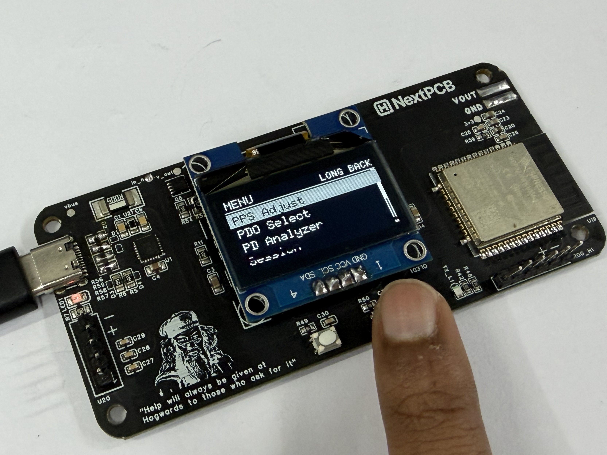

# PowerPD - ESP32 USB-C PD/PPS Programmable Power Supply

<div align="center">
  
[](Picture/PowerPD%20Design.png)

**A Compact, Feature-Rich USB-C Power Delivery Programmable Bench Power Supply**

[](https://www.hackster.io/rau7han/powerpd-esp32-usb-c-pd-pps-programmable-power-supply-c2c4c0)
[](https://hackaday.io/project/205791-powerpd-esp32-usb-c-pdpps-bench-power-supply)
[](https://www.instructables.com/PowerPD-ESP32-USB-C-PD-Bench-Power-Supply/)

</div>

---

## 📋 Table of Contents

- [Introduction](#introduction)
- [Features](#features)
- [Specifications](#specifications)
- [How It Works](#how-it-works)
- [Hardware Overview](#hardware-overview)
- [Gallery](#gallery)
- [Repository Files](#repository-files)
- [Getting Started](#getting-started)
- [Project Links](#project-links)
- [License & Author](#license--author)

---

## Introduction

PowerPD is an innovative ESP32-based **USB-C Power Delivery (PD) and Power Profile Specification (PPS)** programmable bench power supply. It leverages modern USB-C PD technology to provide a flexible, programmable power source that can deliver various voltage and current levels. 

Perfect for **electronics enthusiasts, makers, and professionals** who need a compact, feature-rich power supply for prototyping, testing, and DIY projects.

---

## ✨ Features

- ⚡ **USB-C Power Delivery Support** - Harness power from modern USB-C PD chargers (5V-20V)
- 🎛️ **Programmable Voltage & Current** - User-configurable output with real-time control
- 🔧 **ESP32 Powered** - Full-featured microcontroller for advanced functionality
- 📱 **Interactive Menu System** - Intuitive interface for easy configuration
- 📊 **Real-time Monitoring** - Display current voltage and current output
- 🎓 **Easy Programming** - UART to USB interface for firmware updates
- 💾 **Compact Design** - Space-efficient bench power supply form factor
- 🏗️ **Open Source** - All designs, schematics, and code included

---

## Specifications

| Parameter | Value |
|-----------|-------|
| **Microcontroller** | ESP32 |
| **Input** | USB-C Power Delivery / PPS Charger |
| **Output Voltage Range** | 5V to 20V (via USB PD/PPS protocols) |
| **Programmable Voltage** | User-configurable voltage selection |
| **Programmable Current** | User-adjustable current limits |
| **Control Interface** | Interactive menu system via ESP32 |
| **Communication** | UART to USB interface for programming |
| **Form Factor** | Compact bench power supply |

---

## How It Works

The PowerPD system operates through a simple but powerful workflow:

1. **Power Input** 🔌
   - A USB-C PD/PPS charger supplies power to the system
   - The system negotiates the desired voltage with the charger

2. **ESP32 Control** 🧠
   - The ESP32 microcontroller manages voltage negotiation and current limiting
   - The AP33772S power manager IC provides precise voltage and current regulation

3. **User Configuration** ⚙️
   - Users set desired voltage and current values through an intuitive menu interface
   - Real-time feedback shows current operating parameters

4. **Power Output** ⚡
   - The regulated output is available as a programmable bench power supply
   - Suitable for powering various electronics projects and testing scenarios

---

## Hardware Overview

### 3D Model & Design

<div align="center">


**3D Rendered View of PowerPD Enclosure**

</div>

<div align="center">


**3D-Printable Enclosure Model**

</div>

### PCB & Manufacturing

<div align="center">


**High-Quality PCB from NextPCB**

</div>

---

## Gallery

### Power Output Demonstrations

<div align="center">

#### 5V Output Mode


**PowerPD delivering stable 5V output**

</div>

<div align="center">

#### 16V Output Mode


**PowerPD delivering high-voltage 16V output**

</div>

<div align="center">

#### 20V Output Mode


**Maximum 20V output capability**

</div>

<div align="center">

#### Alternative 5V Output View


**5V output measurement configuration**

</div>

<div align="center">

#### 5V Output (Scaled)


**Compact 5V output demonstration**

</div>

### Control Interface & Menu System

<div align="center">

#### Main Menu Display


**Interactive menu system for voltage/current selection**

</div>

<div align="center">

#### PPS Adjustment Menu


**Power Profile Specification (PPS) adjustment interface**

</div>

### Integration & Monitoring

<div align="center">

#### Live Working Setup


**PowerPD in action - live demonstration**

</div>

<div align="center">

#### Adafruit IoT Dashboard


**IoT monitoring with Adafruit IO integration**

</div>

<div align="center">

#### Adafruit IoT Integration


**Remote monitoring and control via Adafruit IoT**

</div>

### Development & Programming

<div align="center">

#### Programming Interface


**UART to USB interface for firmware programming**

</div>

<div align="center">

#### NextPCB Promotion


**PCB fabrication courtesy of NextPCB**

</div>

---

## Repository Files

| Directory | Description |
|-----------|-------------|
| **Firmware** | ESP32 Arduino code (`PowerPD.ino`) with AP33772S power manager driver for voltage and current control |
| **Gerber Files** | Complete PCB manufacturing files including schematics BOM and centroid files ready for fabrication |
| **Picture** | High-quality project photos, gallery images, and demonstration screenshots |
| **PowerPD Schematic** | Detailed circuit schematics for reference and replication |
| **STL** | 3D-printable enclosure files for project housing |

---

## Getting Started

### Prerequisites
- ESP32 Development Board or PowerPD PCB
- USB-C Power Delivery (PD) Charger (5V-20V recommended)
- Arduino IDE with ESP32 support
- UART to USB adapter (CH340G or similar) for programming

### Quick Start

1. **Clone/Download the Repository**
   ```bash
   git clone https://github.com/Rau7han/PowerPD.git
   ```

2. **Prepare the Firmware**
   - Open `Firmware/PowerPD.ino` in Arduino IDE
   - Include the `AP33772S.cpp` and `AP33772S.h` libraries
   - Select ESP32 board and appropriate COM port

3. **Upload Firmware**
   - Connect UART to USB adapter to programming header
   - Upload the firmware to your ESP32

4. **Power On**
   - Connect USB-C PD charger to the PowerPD input
   - The system will boot and display the menu

5. **Configure Output**
   - Use the menu system to select desired voltage (5V-20V)
   - Adjust current limits as needed
   - Your programmable power supply is ready to use!

---

## Project Links

| Platform | Link |
|----------|------|
| **Hackster.io** | [PowerPD ESP32 USB-C PD/PPS Programmable Power Supply](https://www.hackster.io/rau7han/powerpd-esp32-usb-c-pd-pps-programmable-power-supply-c2c4c0) |
| **Hackaday.io** | [PowerPD - ESP32 USB-C PD/PPS Bench Power Supply](https://hackaday.io/project/205791-powerpd-esp32-usb-c-pdpps-bench-power-supply) |
| **Instructables** | [PowerPD: ESP32 USB-C PD Bench Power Supply](https://www.instructables.com/PowerPD-ESP32-USB-C-PD-Bench-Power-Supply/) |

---

## License & Author

**Author**: [Rau7han](https://github.com/Rau7han)

**License**: See repository for detailed license information

---

<div align="center">

**Contributions, suggestions, and feedback are welcome!** 🎉

If you build PowerPD, we'd love to hear about it! Share your projects and improvements.

</div>
